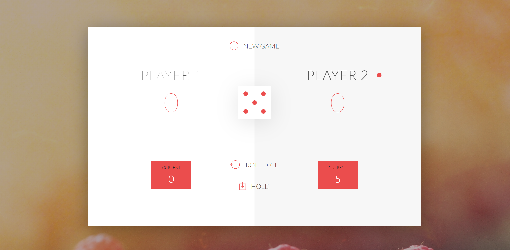

# pigGame
javascript bootstrap two players pigGame

v1.1

1. A player looses his ENTIRE score when he rolls two 6 in a row. After that, it's the next player's turn. (Hint: Always save the previous dice roll in a separate variable) 

